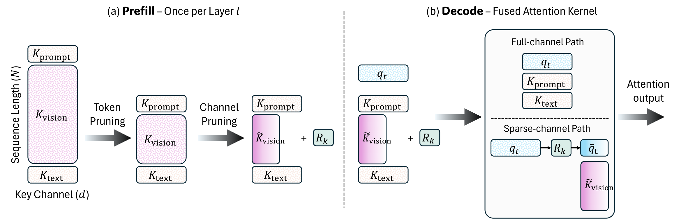

# RotateK

**Rotation-aligned Key-channel pruning for vision-language model inference.**

A single image can occupy thousands of KV-cache entries in a VLM. Token pruning
shrinks that cache by discarding visual tokens outright, which costs accuracy on
fine-grained perception. RotateK compresses the *channel* dimension of the Keys
instead: an online PCA-based rotation aligns token-dependent channel importance
into a shared subspace, so a lightweight head-wise mask can keep a quarter of the
Key channels with little loss. Under a fixed KV budget the freed memory buys more
visual tokens — or, at a fixed token count, a smaller cache.



At **prefill** the rotation `R_k` is built once per layer and the visual Keys are
stored rotated and truncated. At **decode** nothing is reconstructed: the query is
rotated into the same subspace (`q_t → R_k → q̃_t`) and a fused Triton kernel runs
the sparse-channel path over the visual span and the full-channel path over the
prompt and text span in one launch, merging them with a single online softmax.

> 📄 Paper: *Rotation-Aligned Key Channel Pruning for Efficient Vision-Language
> Model Inference* — [arXiv](https://arxiv.org/abs/XXXX.XXXXX)

---

## Install

Python 3.11 and a CUDA-capable GPU are required (the decode kernel is Triton).

```bash
git clone https://github.com/beomseokg/rotatek.git
cd rotatek

conda create -n rotatek python=3.11 -y && conda activate rotatek

# PyTorch first, so triton / flash-attn pick up the matching CUDA build
pip install torch==2.6.0 --index-url https://download.pytorch.org/whl/cu124
pip install -r requirements.txt
```

No `pip install` of this repo is needed — the scripts add the repo root to
`sys.path` themselves, so they run from any working directory.

### For the accuracy benchmarks only

Accuracy is evaluated through [lmms-eval](https://github.com/EvolvingLMMs-Lab/lmms-eval).
RotateK hooks into the model definitions, so the integration files are copied over
an installed lmms-eval:

```bash
pip install lmms-eval==0.6.0

LMMS_DIR="$(python -c 'import lmms_eval, os; print(os.path.dirname(lmms_eval.__file__))')"
cp -r integrations/lmms_eval/* "$LMMS_DIR/"
```

Eleven files are touched: eight model hooks (RotateK, ThinK and SparK on
LLaVA-NeXT, Qwen2.5-VL and InternVL2.5) and three task fixes (`dc100_en`,
`wild_vision_bench`). The directory layout mirrors `lmms_eval/...`, so the copy is
flat. Latency benchmarks do **not** need this step.

---

## Quickstart

Reproduce one accuracy row — Qwen2.5-VL-7B with VisionZip token pruning plus
RotateK channel pruning:

```bash
python scripts/paper/eval/visionzip_qwen.py
```

Or measure decode latency without touching lmms-eval or any dataset (synthetic
inputs, vision tower bypassed):

```bash
python scripts/paper/latency/model_end_to_end_llava_next.py \
    --methods full,think,spark,rotatek \
    --prefill_length 16k --batch_sizes 1 --decoding_length 128 \
    --channel_ratio 0.75 --n_repeats 5
```

`channel_ratio` is the fraction **pruned**, so `0.75` keeps 25% of the Key
channels — the setting used throughout the paper.

---

## Reproducing the paper

| What | Command |
| --- | --- |
| Accuracy, Qwen2.5-VL + VisionZip | `python scripts/paper/eval/visionzip_qwen.py` |
| Accuracy, Qwen2.5-VL + FastV | `python scripts/paper/eval/fastv_qwen.py` |
| Accuracy, LLaVA-NeXT + VisionZip | `python scripts/paper/eval/visionzip_llava_next.py` |
| Accuracy, LLaVA-NeXT + FastV | `python scripts/paper/eval/fastv_llava_next.py` |
| Prefill / decode vs. sequence length | `./scripts/paper/latency/run_llava_next_seqlen_sweep.sh` |
| Prefill / decode vs. batch size | `./scripts/paper/latency/run_llava_next_batch_sweep.sh` |
| Max batch + throughput | `python scripts/paper/latency/max_batch_sweep_llava_next.py sweep --prefill_length 64k --methods full,think,spark,rotatek --decode_tokens 64` |
| Solver comparison (CholQR / eigh / randomized) | `python scripts/paper/latency/kernel_breakdown.py` |

Each eval wrapper has a `__main__` block listing the datasets and the channel
method (`think` / `spark` / `rotatek`) to sweep; edit those lists to change the
grid. Latency runs write a JSON plus a text log under `results/`.

The appendix ablation (Cholesky vs. `eigh`, query-aware vs. query-agnostic) comes
from the same wrappers with different environment variables:

```bash
python scripts/paper/eval/fastv_qwen.py                          # Cholesky + Q-aware (default)
ROTATEK_SOLVER=eigh python scripts/paper/eval/fastv_qwen.py      # full eigendecomposition
ROTATEK_QUERY_AWARE=0 python scripts/paper/eval/fastv_qwen.py    # K-only PCA
```

---

## Repository layout

```
rotatek/                 core method — no model-specific code
  rotation.py            online PCA: covariance → subspace iteration → R_k, δμ
  decode.py              decode entry points
  kernels/               Triton kernels (fused sparse-channel + full-channel decode)
  baselines/             ThinK and SparK, for comparison
integrations/lmms_eval/  drop-in overrides for an installed lmms-eval
scripts/paper/eval/      accuracy drivers used for the paper
scripts/paper/latency/   latency and throughput drivers used for the paper
assets/                  figures
```

`rotatek/rotation.py` and `rotatek/kernels/` have no dependency on any model or
cache class, so they can be reused outside this repo.

---

## Configuration

Behaviour is controlled by environment variables:

| Variable | Default | Purpose |
| --- | --- | --- |
| `ROTATEK_QUERY_AWARE` | `1` | `0` ablates query-weighted PCA (K-only PCA) |
| `ROTATEK_SOLVER` | `power_iter` | `power_iter` (Cholesky-QR subspace iteration), `randomized` (Halko–Martinsson–Tropp), anything else falls back to `torch.linalg.eigh` |
| `ROTATEK_STORAGE` | `truncated` | `truncated` stores rotated Keys at `D_keep` and rotates Q at decode (memory **and** compute savings); `full` stores `K R Rᵀ + μ` at full width (accuracy-equivalent, no savings — useful as a drop-in for the standard FA2 path) |
| `ROTATEK_COMPILE` | unset | `1` or `reduce-overhead` to CUDA-graph the subspace iteration |
| `THINK_COMPILE` / `SPARK_COMPILE` | unset | Same, for the baselines |
| `HF_HOME` | `~/.cache/huggingface` | Model cache |
| `OPENAI_API_KEY` | — | Needed only for GPT-judged tasks (`mmvet`, `llava_in_the_wild`, `dc100_en`) |
| `MODEL_VERSION` | `gpt-4o-mini` | Judge model for those tasks |

---

## Caveats

1. **Triton only.** The fused decode kernel targets Triton ≥ 2.3 with
   FlashAttention-2-style block layouts on NVIDIA GPUs. There is no CPU or ROCm
   path.
2. **Pinned to `transformers==4.47.0`.** The integration files fork HuggingFace
   modeling code, so other versions are not expected to work.
3. **Calibration paths.** Three integration files contain hardcoded directories
   used for offline channel-importance dumps during development. They only matter
   under `calibration_mode=collect`, which none of the reported results use.
4. **GPT-judged tasks cost money.** `mmvet`, `llava_in_the_wild` and `dc100_en`
   call the OpenAI API per sample (~$0.0002/sample with `gpt-4o-mini`).
   `vibe_eval` uses Reka Core instead and needs `reka-api` plus `REKA_API_KEY`.

---

## Citation

```bibtex
@article{kang2026rotatek,
  title   = {Rotation-Aligned Key Channel Pruning for Efficient Vision-Language Model Inference},
  author  = {Kang, Beomseok},
  year    = {2026},
  journal = {arXiv preprint arXiv:XXXX.XXXXX}
}
```

## License

MIT — see [LICENSE](LICENSE).
